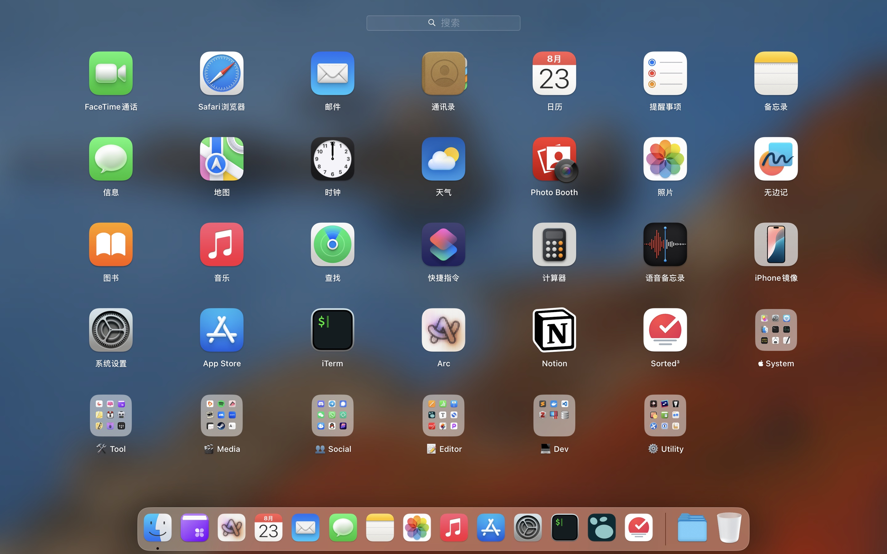

# Config (macOS / iOS / Windows)

> Apps/CLIs/configs I use on macOS/iOS/Windows.

- [macOS Apps](#macos-apps)
- [iOS Apps](#ios-apps)

- [Windows Apps](#windows-apps)

## macOS Apps

### 🛠️Tool

- [Skim](https://skim-app.sourceforge.io/) to read PDF.
- [CleanMyMac](https://cleanmymac.com/) to clean my mac.
- [Permute](https://software.charliemonroe.net/permute/) to convert file formats.
- [Downie](https://software.charliemonroe.net/downie/) to download web contents.
- [AppCleaner](https://freemacsoft.net/appcleaner/) to uninstall apps.
- [QSpace Pro](https://qspace.awehunt.com/) as a better Finder.
- [Session](https://stayinsession.com/) to stay focused.
- [Transmission](https://transmissionbt.com/) to download torrent files.
- [Tailscale](https://tailscale.com/) to access remote devices.
- [FindAnyFile](https://findanyfile.app/) to find any file.
- [Teleprompter](https://www.teleprompter.com/) as a teleprompter.
- [Image2Icon](https://img2icnsapp.com/) to customize icons.
- [Todesk](https://todesk.com/) to control remote computers.
- [Grammarly Desktop](https://www.grammarly.com/desktop) to inspect grammar.

### 🎬Media

- [Elemedia Player](https://www.elmedia-video-player.com/) to play video files.
- [IINA](https://iina.io/) to play video files.

### 👥Social

- [Telegram](https://telegram.org/), [Discord](https://discord.com/), [Signal](https://signal.org/), [Whatsapp](https://www.whatsapp.com/), [Wechat](https://weixin.qq.com/), [Element](https://element.io/) to send and receive messages.
- [Maipo](https://apps.apple.com/cn/app/maipo-for-%E5%BE%AE%E5%8D%9A/id789066512) to read and post Weibo feeds.

### 📝Editor

- [Typora](https://typora.io/) to edit markdown files.
- [PDFgear](https://www.pdfgear.com/) to edit PDF.
- [Capture One](https://www.captureone.com/), [Pixelmator Pro](https://www.pixelmator.com/pro/) to edit photos.
- [Capcut](https://www.capcut.com/) to edit videos.
- [Plain Text Editor](https://sindresorhus.com/plain-text-editor/) to edit plain text files.

### 💻Dev

- [Ghostty](https://ghostty.org/) as terminal emulator.
  - Colors: [Monokai Soda](https://github.com/mbadolato/iTerm2-Color-Schemes/blob/master/iterm-dynamic-colors/Monokai%20Soda.sh)

  - Shell: [Zsh](https://www.zsh.org/) + [Zim](https://zimfw.sh/)

  - Zsh Theme: [powerlevel10k](https://github.com/romkatv/powerlevel10k)
  
- [VS Code](https://code.visualstudio.com/) as main code editor.

- [Parallels Desktop](https://www.parallels.com/) to run VMs.

### ⚙️Utility

- [Raycast](https://www.raycast.com/) to launch apps and commands.

- [1Password](https://1password.com/) to keep all passwords and secret info.
- [Xnip](https://xnipapp.com/) for quick editing of screenshots/screencasts.
- [Clash Verge](https://github.com/clash-verge-rev/clash-verge-rev) for full Internet access.
- [AltTab](https://alt-tab-macos.netlify.app/) to switch between windows.
- [Bartender](https://www.macbartender.com/) to organize menu bar icons.
- [Swish](https://highlyopinionated.co/swish/) to enhance gesture control.
- [Magnet](https://magnet.crowdcafe.com/) to manage windows.
- [Amphetamine](https://apps.apple.com/us/app/amphetamine/id937984704) to keep mac awake.
- [The Unarchiver](https://theunarchiver.com/) to unzip compressed files.
- [Popclip](https://www.popclip.app/) to conduct instant text actions.
- [Dropshelf](https://pilotmoon.com/dropshelf/) for temporary storage.
- [Mac Mouse Fix](https://macmousefix.com/) for mouse configurations.
- [Step Two](https://steptwo.app/) for backup 2FA.
- [MonitorControl](https://monitorcontrol.app/) to control mutipul display brightness.
- [EasyRes](http://easyresapp.com/) for fast resolution switch.
- [Input Source Pro](https://inputsource.pro/) to automatically switch input sources.
- [Quitter](https://marco.org/apps#quitter) to quit inactive apps.
- [Folder Peek](https://sindresorhus.com/folder-peek) for quick folder access.
- [QLMarkdown](https://github.com/sbarex/QLMarkdown) to preview markdown files with Quicklook.

## iOS Apps

> TODO

## Windows App

- [Simple Sticky Notes](https://www.simplestickynotes.com/) to keep simple notes.
- [PixPin](https://pixpinapp.com/) for quick editing of screenshots/screencasts.
- [Twinkle Tray](https://twinkletray.com/) to control multiple display brightness.
- [Sumatra PDF](https://www.sumatrapdfreader.org/) to read PDF.
- [QuickLook](https://github.com/QL-Win/QuickLook) for quick file preview.
